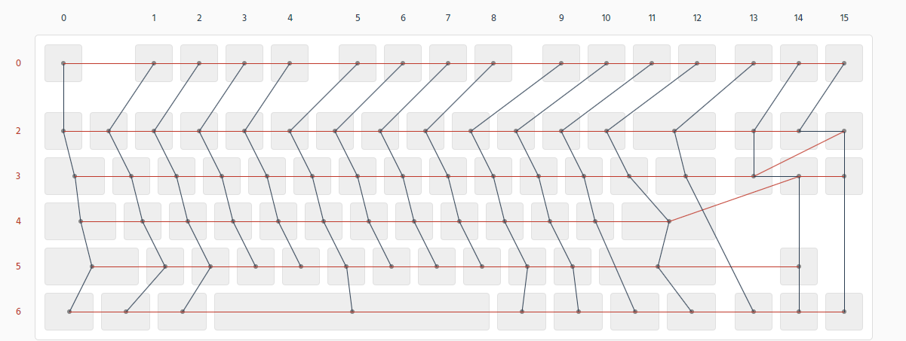

# Core73 测试固件

```shell
make go
```

测试用的固件。不带休眠和指示灯功能，仅用于测试。按 Fn+Tab 切换设备，Fn+CapsLock 休眠。



- 按键阵列Row：22, 23, 24, 25, 28, 29
- 按键阵列Col：9, 8, 7, 6, 5, 4, 3, 11, 12, 13, 14, 15, 16, 17, 18, 19
- NumLock：30
- CapsLock: 31
- Bootloader: 10
